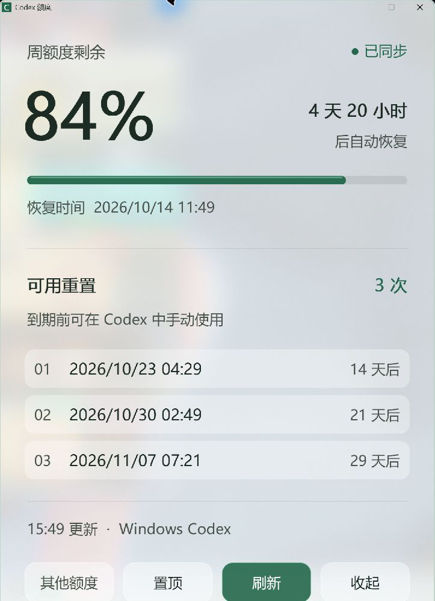

# Codex Quota Widget · Codex 额度小窗

由 Codex 开发的 Windows 原生额度小窗。

查看 Codex 剩余额度、恢复倒计时和可用重置次数。支持玻璃背景、置顶、托盘、每分钟刷新，以及 Windows / WSL 自动连接。

<a href="docs/images/widget-2x.png"></a>

## Agent 安装

1. 检查 Windows 上的 Codex 桌面应用或 CLI，复用已有 ChatGPT 登录。
2. 下载[最新发布包](https://github.com/jojoasd123/codex-quota-widget/releases/latest)，解压到安装目录。升级时先退出旧程序，保留 `codex-quota.json`。
3. 运行 `--check`，确认连接来源和额度结果，再启动程序。

使用 GitHub CLI 下载：

```powershell
$quotaStage = Join-Path $env:TEMP ('codex-quota-' + [guid]::NewGuid())
New-Item -ItemType Directory -Path $quotaStage | Out-Null
gh release download --repo jojoasd123/codex-quota-widget `
  --pattern 'CodexQuota-*-windows-x64.zip' --dir $quotaStage
if ($LASTEXITCODE -ne 0) { throw 'Release download failed' }
$quotaArchive = Get-ChildItem -LiteralPath $quotaStage -Filter '*.zip'
Expand-Archive -LiteralPath $quotaArchive.FullName -DestinationPath $quotaInstallDir
```

`$quotaInstallDir` 由 Agent 按目标环境设置。

## 连接配置

默认自动寻找 Windows PATH、Codex 桌面应用、npm 安装及 WSL 中的 Codex。多账号时固定选择对应环境。

可在 exe 同目录创建 UTF-8 无 BOM 的 `codex-quota.json`：

| 字段 | 用途 |
| --- | --- |
| `backend` | `auto`（默认）、`native`、`wsl` |
| `codexPath` | 指定本机 `codex.exe` 路径 |
| `wslDistro` | 指定 WSL 发行版，省略时使用默认值 |
| `wslUser` | 指定 Linux 用户，省略时使用默认值 |

```json
{"backend":"wsl","wslDistro":"Debian","wslUser":"your-linux-user"}
```

环境变量：`CODEX_QUOTA_CONFIG` 指定配置文件；`CODEX_QUOTA_CODEX` 指定本机 CLI。`codexPath` 优先于环境变量。

## 验证与启动

```powershell
$quotaExe = Join-Path $quotaInstallDir 'CodexQuota.exe'
$quotaCheck = Join-Path $env:TEMP ('quota-check-' + [guid]::NewGuid() + '.json')
$quotaProcess = Start-Process -FilePath $quotaExe -WindowStyle Hidden -Wait -PassThru `
  -ArgumentList @('--check', ('"{0}"' -f $quotaCheck))
if ($quotaProcess.ExitCode -ne 0) { throw 'Quota check failed' }
Get-Content -LiteralPath $quotaCheck -Raw | ConvertFrom-Json
Start-Process -FilePath $quotaExe -WorkingDirectory $quotaInstallDir
```

查询成功返回 exit 0，JSON 包含 `ok`、`source`、`windows`；失败返回 exit 1 和 `error`。确认 `source` 对应所选环境。

桌面快捷方式：程序路径指向 `CodexQuota.exe`，工作目录为安装目录，图标使用 `CodexQuota.ico,0`。

连接失败时检查 Codex 登录、实际二进制路径；WSL 用 `wsl --list --quiet` 确认发行版。

## 构建

Rust stable、Windows MSVC 工具链和 Visual Studio C++ Build Tools：

```powershell
cargo fmt --all -- --check
cargo test --locked
cargo clippy --locked --target x86_64-pc-windows-msvc -- -D warnings
cargo build --locked --release
```

GitHub Actions 自动测试并构建 Windows portable 包。

额度接口：[Codex App Server](https://learn.chatgpt.com/docs/app-server#6-rate-limits-chatgpt) 的 `account/rateLimits/read`。

## License

MIT。
